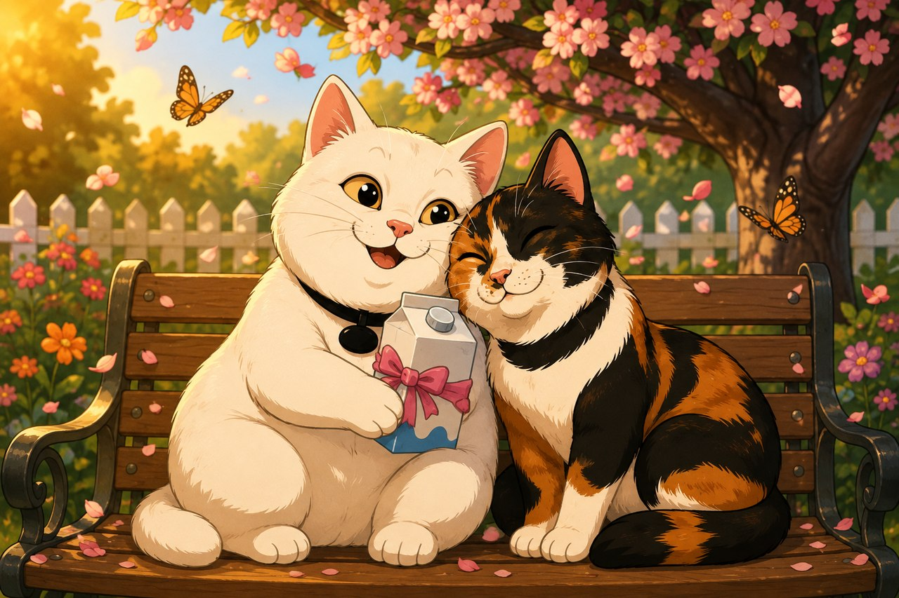

# 🐱 Benito: Aventura Felina

A browser-based 3D cat adventure game built with [Three.js](https://threejs.org/) — no build step, no dependencies to install, just static files and a web server.



## Story

Benito is a chubby, food-obsessed white cat with a big heart. One night, a stray dog kidnaps his girlfriend Didi. Benito sets off across the garden — climbing walls, crossing a stream, fighting off rival cats, sneaking into houses, and eventually facing down the Gato Grande — to get her back.

The full intro is playable in-game via the **"Ver Historia"** button on the start screen (shown automatically the first time you load the game).

## Features

- **Open, branching level** — a hub plaza with side paths (a hidden room, a climbable lookout tower), a water crossing, a gated boss wing, and an enemy gauntlet that escalates toward the final boss.
- **Movement & combat** — running, jumping, wall-climbing, a claw attack, and a chargeable AoE "Super Zarpazo" special move (radial claw burst + dust explosion) once you've landed enough hits.
- **Progression** — milk cartons heal you; every 3 tuna cans collected permanently grows your max health.
- **Enterable houses** — doors (some locked, needing a key found elsewhere) leading into interiors, including two mini-games:
  - Smash a couch to break it open for supplies.
  - Sneak into a kitchen, steal a fish, and escape before the suspicious old lady notices.
- **Boss fight** — a giant cat that lobs projectiles and has a telegraphed wind-up you can punish.
- **Procedural audio** — all sound effects and the story's background music are synthesized live via the Web Audio API (no audio files).
- **Story intro** — a Star Wars–style scrolling text crawl over illustrated panels, with its own background theme.

## Controls

| Key | Action |
|---|---|
| Arrow keys | Move |
| A / D | Rotate camera |
| W / Q | Raise / lower camera |
| Shift | Run |
| Ctrl | Jump |
| Space | Claw attack |
| E | Climb (near a climbable wall) |
| F | Enter / exit (near a door) |
| S | Super Zarpazo (once the meter is full) |

## Running it locally

This is a static site — any local HTTP server works. It can't be opened directly as a `file://` URL because of browser fetch/CORS restrictions on loading the 3D models and textures.

```bash
cd benito-game
python3 -m http.server 8899
```

Then open `http://localhost:8899` in a browser.

## Project structure

```
index.html            Entry point, HUD, and modal markup
css/style.css          All styling
js/
  main.js              Bootstraps Three.js, the game loop, camera, HUD
  player.js            Benito: movement, physics, combat, climbing
  enemy.js / boss.js    Rival cats and the final boss
  destructible.js       Breakable props (the couch mini-game)
  granny.js             The kitchen heist NPC
  collectible.js         Pickups: milk, tuna, keys, the stolen fish
  level.js               Level builder (turns level data into a 3D scene)
  levels/                Level definitions (level-garden.js is the default)
  props.js / silverpaw.js  Loaders for the 3D character/prop models
  audio.js / music.js    Procedural sound effects and music
  story.js               The story intro viewer
  vendor/                Bundled third-party libraries (Three.js, FBXLoader, etc.)
assets/                 3D models, textures, and story artwork
```

## License

Code is licensed under the terms in [LICENSE](LICENSE) (Apache 2.0). The bundled 3D character and prop models under `assets/` are third-party assets and are not covered by that license — see their respective sources for terms.
